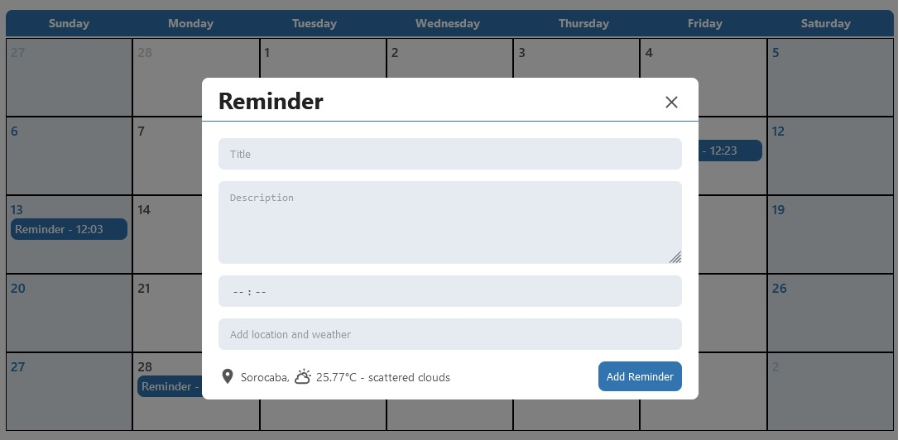

# React Calendar
> Web Calendar with weather and date reminders

 

# :rocket: Features

* Styled-Components for styling
* Axios for connection to the weather api 
* Context-Api
* Custom hooks for Calendar functions
* React-icons
* Material-ui for modal component

# :framed_picture: UI
* This is a single view of a calendar modal component of the web application.

   

# :runner: Getting Started

 - Run `npm install` | `yarn install` to install all dependencies.
 - Run `npm start`   | `yarn run` to run the app locally.
 - You can find the project running on `localhost:3000`.